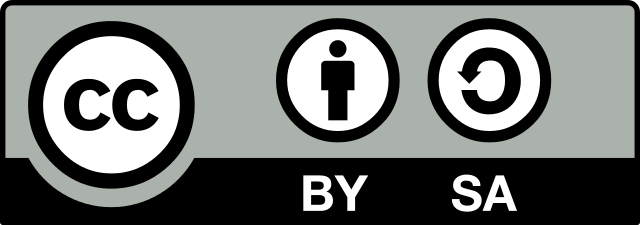

## Les objectifs à long terme

- Programmer : Python
- Bosser à plusieurs : GIT
- Bien bosser : bonne pratiques

. . .

On verra à chaque phase où on en est sur tout ça...

## Les objectifs de cette phase

- Écrire un premier micro programme
- Décrire le projet
- Trouver les premières étapes techniques
- Bosser par mail avant de bosser sur GIT

## Écrire un premier micro programme

```python
>>> print 'Hello les amis des serpents'
Hello les amis des serpents
```

. . .

et qu'on transformera en un joli fichier :

. . .

```python
#!/usr/bin/env python

def main():
  print "Hellos les amis des serpents"

if __name__ == "__main__":
  main()
```

---

C'est pour ça que tu devais lire le chapitre 1 du bouquin sur python !

## Décrire le projet

Il va falloir que tu décrive ton projet à toi

- une page max
- pas de descripton technique
- description de ce que ça doit faire
- pas d'historique ou de pourquoi (mais tu peux écrire ça dans un autre doc d'une page aussi)

---

Aller hop tu as une semaine pour faire ça !

## Trouver les première étapes technique

À partir de ton doc je vais trouver qu'est ce qu'on peut faire en premier.

---

Je vais faire en sorte qe ça soit intéressant du point de vue didactique :

- pas trop complexe techniquement
- mais tout de même qui t'apprend de nouvelles choses
- rapide à faire

## Bosser par mail avant de bosser sur GIT

On ne va pas utiliser GIT pour cette première partie.

. . .

On va utiliser la bête communication par mail pour s'échanger des fichier texte.

. . .

Ça permet de bien voir quel est l'intéret de GIT après.

## Ce qui sera produit

- un fichier `hello_python.py` avec ton premier programme
- un fichier `README.txt` avec : la description de ton projet, l'historique de ton projet (si tu veux), ma description des première étapes techniques
- un fichier `ton_projet.py` avec le début de ton code

## Des questions ?

> Your one and only source into the scandalous lives of Manhattan's elite

<pym.aldebaran@gmail.com>

:wink:

---



Ce document est mis à disposition selon les termes de la [Licence Creative Commons Attribution -  Partage dans les Mêmes Conditions 3.0 France](http://creativecommons.org/licenses/by-sa/3.0/fr/).
